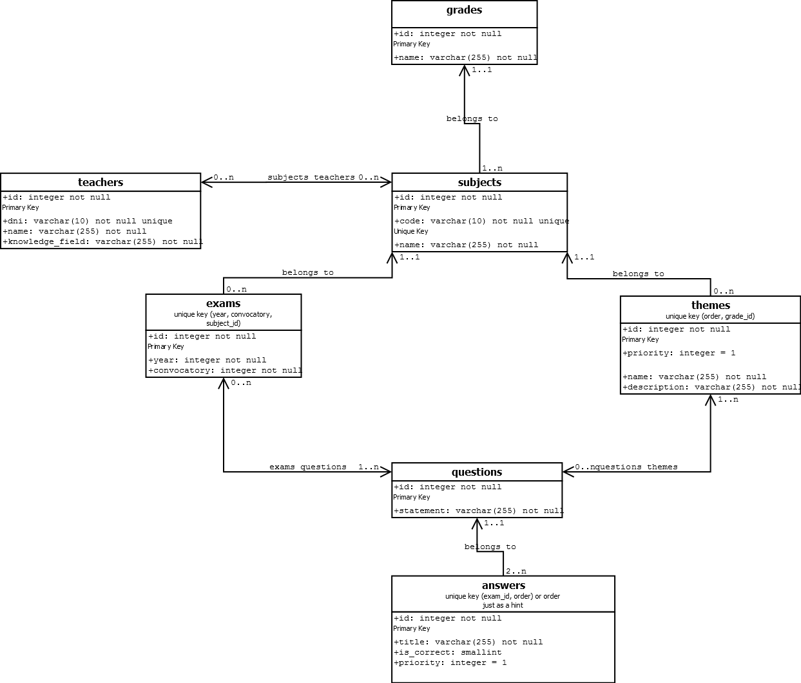
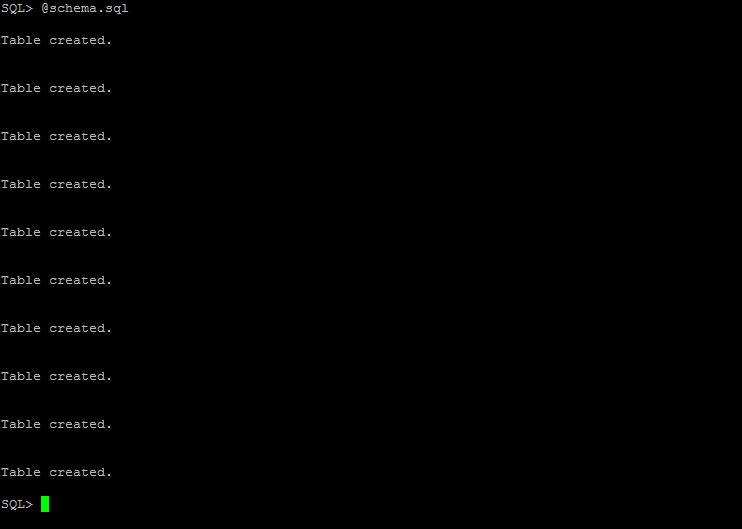
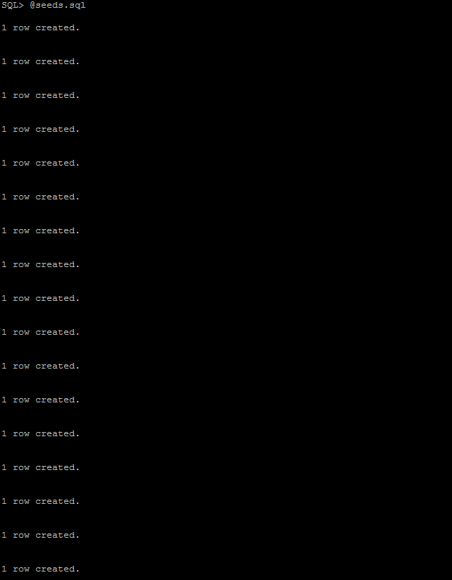
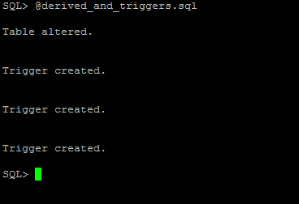
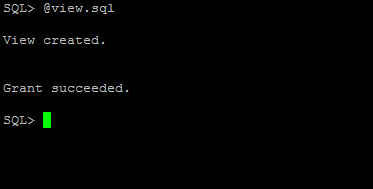
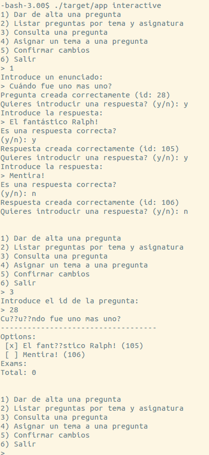
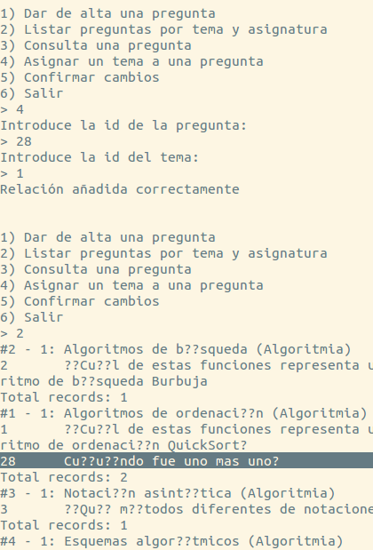
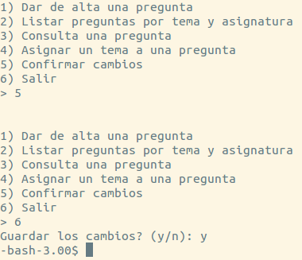

# Descripción de las tablas generadas

## Diseño conceptual (diagrama entidad relación)

El diagrama ha sido generado con la herramienta *GNU DIA*. Ésta herramienta no deja usar flechas dobles en las asociaciones entre clases UML, por lo que se usará una flecha para asociaciones con cardinalidad máxima n, y no se usará flecha en el lado de la asociación con cardinalidad máxima 1.



### Convenciones utilizadas
* Si un atributo tiene varias palabras en su nombre, se separarán con barras bajas.
* Las tablas que representan una entidad se llamarán como la entidad, pluralizado.
* Las tablas para relaciones `n-m` se designarán mediante el nombre las entidades relacionadas, ordenadas alfabéticamente y pluralizadas. (Ejemplo: `teachers_subjects`).
* Las claves primarias preferiblemente tendrán el nombre `id`, mientras las claves foráneas seguirán la forma `<entidad>_id`.
* Se prefiere usar un atributo `priority` para ordenar en vez de órdenes fijos y únicos: No sólo simplifica el diseño sino que es más flexible.

## Relacional

El modelo relacional, siguiendo las anteriores convenciones, quedaría:

* **grades** (**id**, name)
* **teachers** (**id**, dni, name, knowledge\_field)
* **subjects** (**id**, code, name, *grade\_id*)
* **themes** (**id**, priority, name, description, *subject\_id*)
* **questions** (**id**, statement)
* **answers** (**id**, title, is\_correct, priority, *question\_id*)
* **exams** (**id**, year, convocatory, *subject\_id*)
* **questions_themes** (**_question\_id_**, **_theme\_id_**)
* **exams_questions** (**_question\_id_**, **_exam\_id_**, correct\_answer\_count, incorrect\_answer\_count, unreplied\_answer\_count)
* **subjects_teachers** (**_subject\_id_**, **_teacher\_id_**)

Es apreciable que todas las tablas identificadas por un campo `id` (superclave) están en FNBC.

# Compilación y creación de las tablas

Desde la carpeta del proyecto ejecutar:

```
$ ./configure
$ make
$ cd etc/sql && make
```

**Nota**: en olivo, `make` debe ser sustituido por `gmake`

El primer `make` compilará la aplicación en el directorio `target/`, mientras que el segundo creará las tablas, el atributo derivado, la vista, e insertará los datos de prueba.

## Multiplataforma

La aplicación está hecha para que sea funcional tanto en el entorno *Oracle* como en un entorno local con *PostgreSQL* y *ecpg* (sólo consultas, ver abajo).

Por lo tanto, dadas las diferencias entre un sistema y otro hemos dividido los makefiles en: `oracle.mk` (exclusivro para entorno de *Oracle*), `local.mk` (exclusivo para *PostgreSQL*) y `common.mk` (funcionalidad común, la mayoría).

El script `configure` se encarga de detectar la plataforma y generar el `Makefile` adecuado.

### Notas acerca de la compilación en *Oracle*
Usamos un pequeño archivo sh (`oracle-prepro`) para poder compilar con una interfaz similar a la de `gcc` o `ecpg` (compila el archivo pasado como segundo argumento con las opciones deseadas). Usamos la opción `DYNAMIC=ORACLE` ya que con esta configuración el mensaje de error en `sqlca.sqlerrm.sqlerrmc` funciona como se espera.

Los **warnings** generados por `Pro*C` acerca del macro `CALL` deberán ser ignorados. Se deben a que usa argumentos variables (`C99`), y el preprocesador analiza código según `C90` (*Ya va siendo hora de actualizar... __ejem__*).

### Notas acerca de la compilación en *PostgreSQL*
En un entorno local con *PostgreSQL* las tablas se crean en una base de datos llamada `exams` a nombre del usuario por defecto (`postgres`).

Para compilar se usa `clang`.

En este entorno **la aplicación fallará al crear cualquier registro**. Esto es porque *PostgreSQL* no es compatible con la sintaxis de los triggers de *Oracle*, y por lo tanto la generación automática del atributo `id` no funcionará.

No se insistió en este aspecto porque la prioridad era que fuera completamente funcional en *Oracle*. No obstante **no sería muy complicado** conseguir que fuera completamente funcional.

# Ejecución

La aplicación está diseñada para poder funcionar sin interacción del usuario, mediante una pequeña serie de comandos.

Puedes ver los comandos ejecutando:

```
$ ./target/app help
```

## Ejecución en modo interactivo

El comando `interactive` es un comando especial, ya que permite al usuario interaccionar directamente en lugar de mediante consola.

Para usar la sesión interactiva usaremos:

```
$ ./target/app interactive
```

Donde se podrá ver un menú con el que el usuario puede interaccionar.

## Funcionalidad no requerida

Se puede apreciar en la ayuda de los comandos que hay funcionalidad no requerida para el enunciado. Algunos ejemplos son:

```
./target/app question -d <id>          # Borra una pregunta
./target/app question -e <id> <statement> # Cambia el enunciado de una pregunta
./target/app question -l [--detailed]  # Muestra todas las preguntas, opcionalmente con sus detalles
./target/app exam -l <question_id>     # Lista todos los exámenes para una pregunta
./target/app answer -l <question_id>   # Lista todas las respuestas para una pregunta
./target/app answer -d <id>            # Borra una respuesta
```

No se han hecho entradas interactivas de algunas de ellas por cuestión de tiempo.

# Detalles curiosos

* Se ha evitado el tener que especificar la id al insertar los datos mediante un uso de triggers y secuencias. Los triggers son autogenerados por el script `etc/sql/scripts/generate_triggers.sh`.
* La vista cuenta los temas que no tienen ninguna pregunta asignada, eso se consigue con una subselect. El rendimiento probablemente sea peor que sin ella, pero tenemos el juego de datos esperado.
* La documentación se genera automáticamente. Para generarla sólo es necesario usar `make docs` (teniendo `pandoc` y `LaTeX` instalados).
* Se ha trabajado usando un repositorio `git`. Probablemente el código sea liberado tras el plazo de entrega de la práctica en [éste repositorio](http://github.com/ecoal95/dbs-2015).

# Estructura del código SQL

El código sql se encuentra en la carpeta `etc/sql/`. Bajo el directorio `etc/sql/src/` se encuentran:
 * `schema.sql`: El esquema de la base de datos.
 * `derived_and_triggers.sql`: El atributo derivado y los triggers necesarios para gestionarlo automáticamente.
 * `seeds.sql`: Inserción de valores de prueba de la base de datos.
 * `view.sql`: La vista requerida por el enunciado.
 * `oracle-drops.sql`: Drops de las tablas en *Oracle* (en *PostgreSQL* borramos la base de datos directamente).

**Nota**: El esquema de la bd varía un poco con respecto al propuesto. Cada tema pertenece exclusivamente a una asignatura, y en vez de forzar órdenes, usamos un campo `priority`, que es más flexible. Se puede ver la estructura en el esquema de la carpeta `doc/`


# Estructura del código C

El código C relativo a la funcionalidad está todo en el directorio `src/`. El programa está organizado por subcomandos, declarados todos en el fichero principal `app.sc`:

```c
/* The list of our supported commands */
struct command commands[] = {
    { "question",  question, "manages questions",
        "Usage: question [args...]\n"
        "\t-a\tcreates a new question\t-a <statement>\n"
        "\t-d\tdeletes a question\t-d <id>\n"
        "\t-e\tedits a question\t-e <id> <statement>\n"
        "\t-s\tshows a question\t-s <id>\n"
        "\t-l\tlists all questions\t-l [<theme_id>] [--detailed]\n"
        "\t-t\tlists all questions by theme and subject\t-t [--detailed]\n"
        "Prints the question id on success to stdout." },
    { "answer", answer, "manages answers",
        "Usage: answer [args...]\n"
        "\t-a\tcreates an answer\t-a <question_id> <statement> [--correct]\n"
        "\t-l\tlist answers for a question\t-l <question_id>\n"
        "\t-d\tdeletes a question\t-d <id>" },
    { "exam", exam, "manages exams",
        "Usage: answer [args...]\n"
        "\t-l\tlist exams for a question\t-l <question_id>\n" },
    { "questions_themes", questions_themes, "Relation between questions and themes",
        "\t-a\tads a new relationship\t-a <question_id> <theme_id>\n" },
    { "interactive", interactive, "Open an interactive session" },
    { NULL, NULL, NULL, NULL }
};
```

El código relativo a la ejecución de los comandos, al ser algo no relacionado con el funcionamiento en sí de la práctica, está en el directorio `lib/`.

Cada estructura de la lista contiene el alias del comando (la forma de llamarlo), la función que ejecuta (siendo de la forma `int (*) (int argc, char** argv)`), una descripción corta que se escribe al ejecutar el comando autogenerado `help`, y una larga que se escribe al ejecutar el comando `help <comando>`.

Cada función es encargada de leer el resto de argumentos, y hacer lo que crea conveniente con ellos, y está declarada en un fichero `.h` con el mismo nombre, y definida en el fichero `.sc` correspondiente.

Las funciones interaccionan entre ellas usando el macro `CALL` (`common.h`), que manipula los argumentos convenientemente para **simular una llamada desde la consola**.

Así, escribir:

```
CALL(question, "-l");
```

Es equivalente a ejecutar:

```
$ ./target/app question -l
```

# Capturas de pantalla

## Creación de las tablas



## Inserción de datos



## Atributo derivado



## Creación de la vista



## Aplicación (sesión interactiva)





# Código fuente

Se incluyen tanto los ficheros sql como los de C, no se incluye lo necesario para compilarlos sin embargo.
